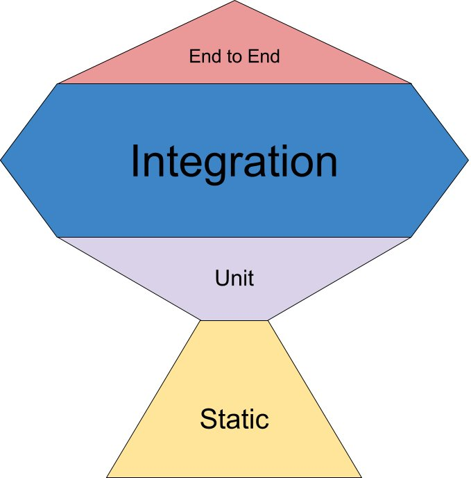

# Integration Tests performance demo

## TL;DR
Integration tests in ASP.NET Core are fast. **A large chunk of your unit tests could probably have been integration tests instead.**

To demonstrate that integration tests can run at speeds comparable to unit tests, we run 10 000 integration tests against a basic ASP.NET Core web api. 
The test scenarios execute very fast. The tests themselves are easy to write and understand.

| Scenario                                 | No. of tests | Test run time |
|------------------------------------------|--------------|---------------|
| Scenario 1 - POST `TodoItem`             | 10 000       | 3s            |
| Scenario 2 - POST `TodoItem` then GET it | 10 000       | 10s           |

## Short note on test levels
In this document, we take the different test levels to mean the following:
- **Unit tests** - we test methods and classes of our application in isolation. Making use of mocks wherever there is a dependency on code external to that method or class.
- **Integration tests** - we wire up the entire application and test functionality through the application's API as it would be used by the user. Using mocks and/or fakes (such as an in-memory db) for dependencies external to the application code.
- **E2E tests** - we wire up the entire application and most, preferably all, of its dependencies and test some piece of functionality end-to-end.

## Pyramids and other geometric shapes
The traditional way of establishing your test suite is to follow the prescriptions of the [test pyramid](https://martinfowler.com/articles/practical-test-pyramid.html):

More unit tests, because they are faster to execute and cheaper to implement. Less E2E, because they are slower and more expensive.

However, it's important to acknowledge that the test pyramid is not derived from first-principles. It's derived from the characteristicts of the different types of testing at the time it was proposed.
We should therefore not accept this as the only way. If those characteristics were to change for a particular tech stack or codebase, we should expect the pyramid to morph into some other shape.

If your primary motive for testing is to assert that the software will actually work when it's released, it's clear that tests further up in the pyramid are more valuable to you than tests further down. 
These tests are testing the functionality that users of your system will actually care about. I therefore argue that we should always be on the lookout for opportunities to move our testing efforts upwards in the chart.

Who cares if my unit tests confirm that the `TodoService` returns the correct list of `TodoItem`s given a certain response from `ITodoRepository.GetTodos()`. What I REALLY want to know is that when I call `GET /api/todoitems`, I will get all the `TodoItem`s I inserted earlier.
If I am confident that this works, I don't really care about the internals of the API.

### The test trophy
Image a world in which integration tests execute on a time scale similar to unit tests. And one where writing and maintaining integration tests to obtain confidence in the software is cheaper/faster than writing unit tests. 
In such a world, I would write less unit tests and more integration tests. 

Enter the world of ASP.NET Core. Where [`WebApplicationFactory`](https://learn.microsoft.com/en-us/dotnet/api/microsoft.aspnetcore.mvc.testing.webapplicationfactory-1?view=aspnetcore-6.0) lets us execute calls towards our API within the context of a test, directly from our dev machine. And it's reasonably fast (which the demo will show).

This gives rise to a different shape, the [test trophy](https://kentcdodds.com/blog/the-testing-trophy-and-testing-classifications):

Even though it was originally created with frontend applications in mind, it can be applied to backend applications as well. 
If you have the technology to run and write integration tests in a fast and cheap way you should prefer to do most of your testing at the integration level.

## Demo
For the demo, we'll use `WebApplicationFactory` to spin up a basic ASP.NET Core web api that lets the user manage `TodoItem`s. We'll be running 10 000 tests against this API. 
We'll run two different scenarios, to get a feel for how the run time of the tests behaves for different operations.

Tests will be run in parallel. The API is designed to handle concurrent requests, so that should not be an issue. If some tests need to be run in isolation, we could use `[DoNotParallelize]`.

See [src](/src) for details on the API and test code.

### Scenario 1 - POST
In the first scenario, each test will call `POST /api/todoitems` to store a new `TodoItem`. 

### Scenario 2 - POST then GET
In the second scenario, each test will first call `POST /api/todoitems` to store a new `TodoItem`. Then the test will call `GET /api/todoitems{id}` to fetch the newly created `TodoItem`

### Results
| Scenario                   | No. of tests | Test run time |
|----------------------------|--------------|---------------|
| Scenario 1 - POST          | 10 000       | 3s            |
| Scenario 2 - POST then GET | 10 000       | 10s           |

## Drawbacks of less unit tests
No documentation of expected behavior of internals through targeted tests.

Internals won't necessarily be testable in isolation (is this necessarily bad?).
